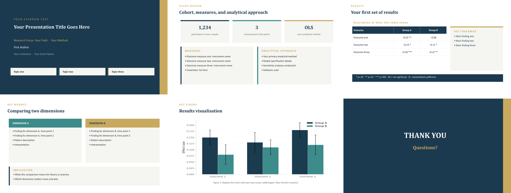
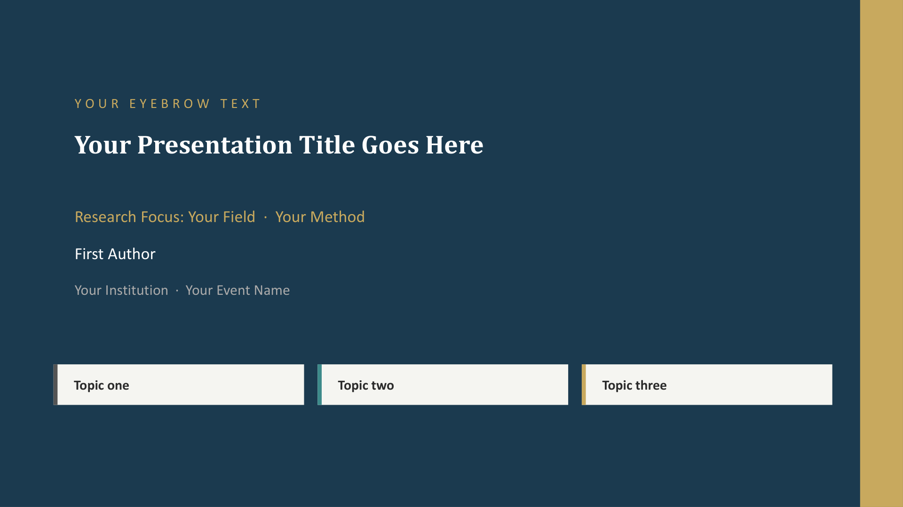
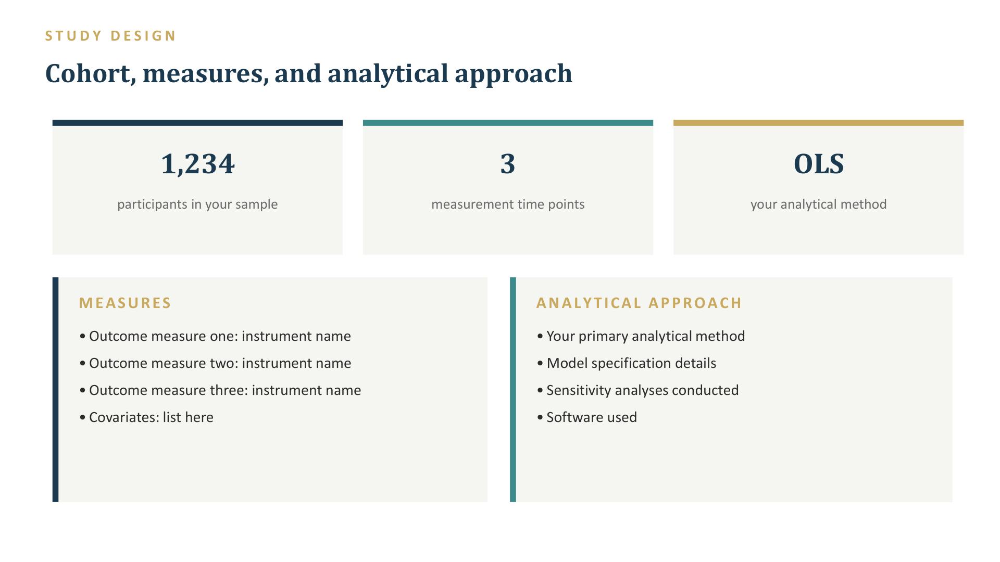
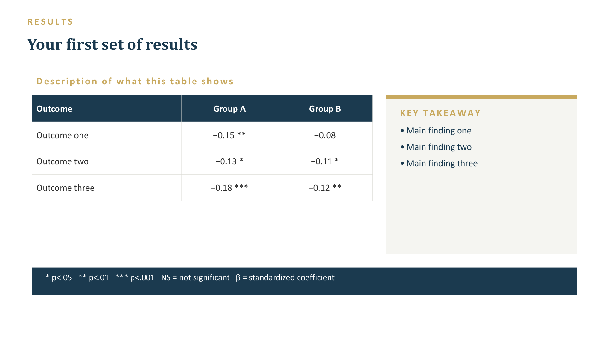
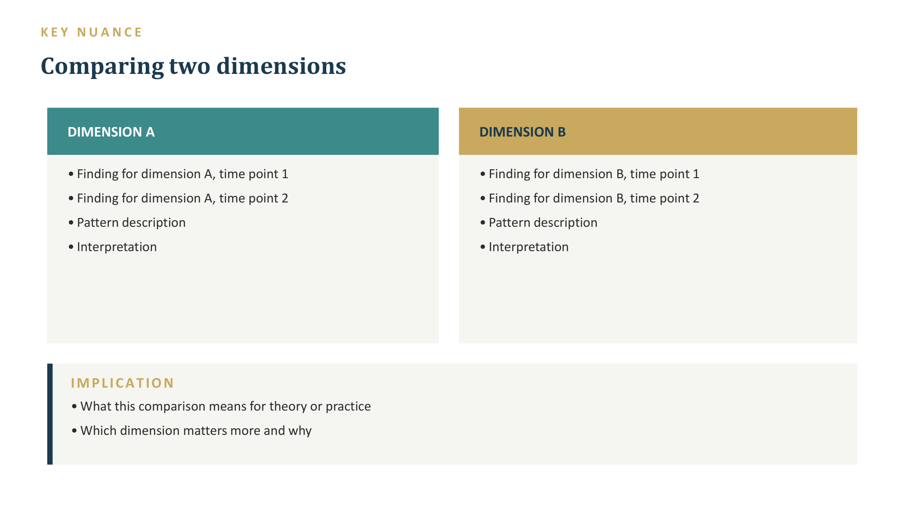
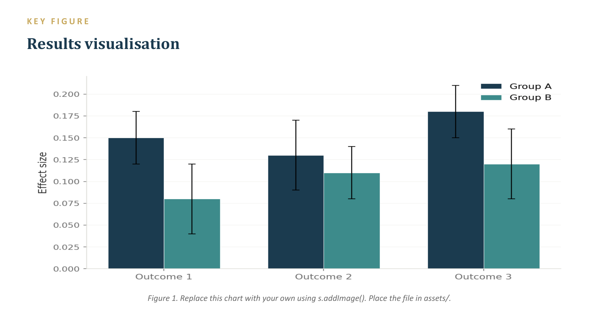

# deckgen

**Generate PowerPoint slides with AI agents.** Feed a research paper, thesis chapter, study report, or any structured text to an AI agent — get back a polished `.pptx` with speaker notes, consistent styling, and editable source code you can diff and version-control.



## What deckgen does

deckgen is an [agent skill](SKILL.md) that teaches an AI to produce
`pptxgenjs`-based presentations. You describe what you want — or hand the agent
a document — and it generates a `.js` file that builds the `.pptx` on `node`
run. Every deck uses the same visual system (navy/teal/gold palette, Cambria +
Calibri fonts, layout constants) so slides stay consistent without manual
formatting.

### From report to slides in one prompt

```
"Turn this paper into a 10-minute presentation.
 Include speaker notes for every slide."
```

The agent reads your document, extracts the key contributions, and produces a
`.js` file with slides for: title, research question, methods, results (tables +
stat cards), key findings (two-panel comparisons), discussion, implications, and
closing. Each slide gets speaker notes that explain the content in natural
language — ready for rehearsal.

This works with:

- **Research papers** — extract methods, results, and contribution statements
- **Thesis chapters** — compress a literature review or results chapter into a
  defence-ready deck
- **Study reports** — pull stat tables, findings, and recommendations into a
  client-facing deck
- **Literature reviews** — compare findings across studies in two-panel layouts
- **Grant applications** — structure aims, significance, and approach slides

### Speaker notes on every slide

Every slide generated by the skill includes speaker notes — natural-language
talking points that walk through the slide content. The agent writes these from
your source material, so they're not generic placeholders but actual
presentation script you can rehearse with.

### Further customisation via prompting

Once the agent generates a deck, you can refine it by prompting:

```
"Make the results slide a table instead of stat cards."
"Add a slide comparing treatment vs control groups."
"Shorten the speaker notes — I speak faster than this."
"Change the colour scheme to match my university brand."
"Add the effect sizes from Table 3 to the key findings slide."
```

The agent edits the `.js` file and re-runs the build. You keep full control of
the source.

### Images and figures

The template supports embedding images via `pptxgenjs` image methods. Place
your `.png` or `.jpg` files in `assets/` and the agent will reference them with
`s.addImage()`. When no image file is available, the template uses a clean
placeholder with a caption. Contributions welcome for automatic figure
extraction and responsive sizing.

## Quick start

```bash
npm install
node build_deck.js        # generates Presentation.pptx
```

The template produces 11 slides with placeholder content demonstrating every
layout type.

## Slide types

### Title slide

Navy background with gold accent, topic tags, and author info:



### Stat cards

Three cards across with large numbers and coloured top bars — ideal for sample
size, follow-up duration, and key metrics:



### Result tables with key takeaway boxes

Navy-header tables on the left, grey takeaway boxes on the right — for showing
effect sizes, p-values, and summarising what they mean:



### Two-panel comparison

Side-by-side panels with coloured headers — for contrasting two dimensions,
subgroups, or theoretical perspectives:



### Figure / results visualisation

Full-width figure area with placeholder and caption — embed real charts, plots,
or diagrams via `s.addImage()`:



### Closing slide

Navy background with centred title and gold accent:


## Layout system

All positions are defined in a `LAYOUT` constants object, so changing one value
updates every slide that uses it. The template includes four reusable helpers:

- **`addKeyBox`** — grey card with gold bar, title, and bullet list (warns on
  overflow)
- **`addPanelBox`** — coloured header bar with content below
- **`addAccentPanel`** — left accent bar with section title and bullets
- **`addResultTable`** — consistent table layout with navy headers

## What's inside

| File | Purpose |
|------|---------|
| `build_deck.js` | Template with 11 slides, placeholder content, and speaker notes — edit this or let the agent rewrite it |
| `Presentation.pptx` | Pre-built output from `build_deck.js` — open directly or regenerate with `node build_deck.js` |
| `SKILL.md` | Agent skill: palette, fonts, helpers, slide patterns, anti-patterns |
| `package.json` | pptxgenjs dependency |
| `package-lock.json` | Locked dependency versions for reproducible builds |
| `assets/` | Preview screenshots and composite overview image |

## Tech

Vanilla Node.js + [pptxgenjs](https://github.com/gitbrent/PptxGenJS). No
build step, no transpilation, no frameworks. The agent skill is a single
Markdown file — works with any AI tool that reads files.
